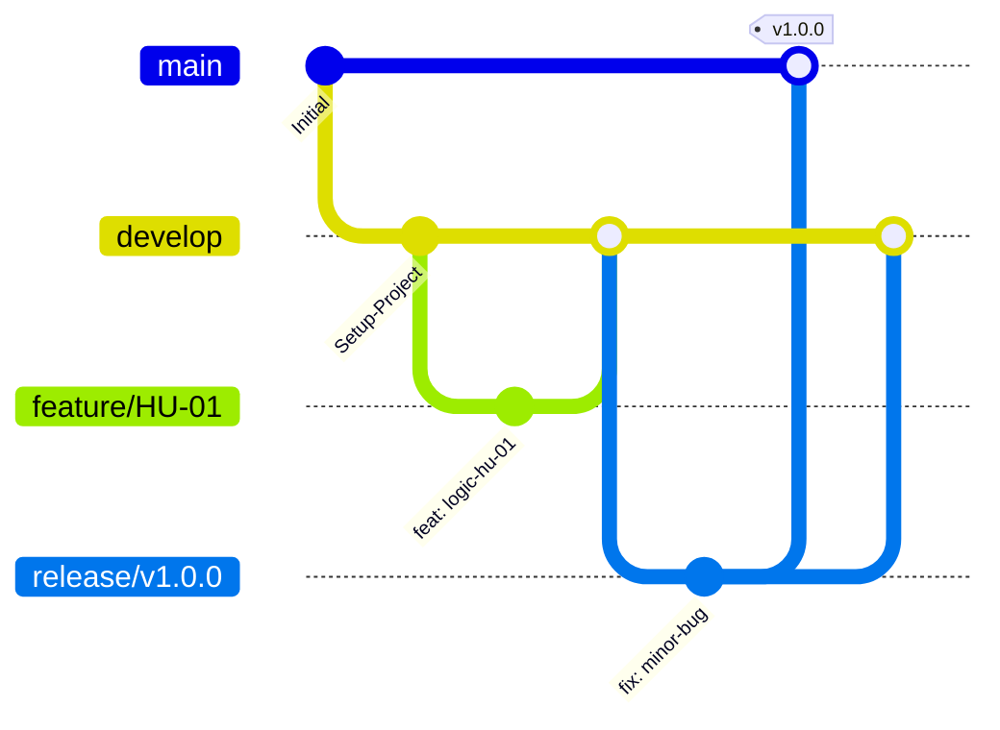

# AgroValle Connect


## 🌱 Declaración de la Visión del Producto

> **Para** los productores del Valle del Cauca,
> **Que** necesitan vender directo y sin intermediarios excesivos,
> **AgroValle Connect** es una plataforma web empresarial en Java 17 / Spring Boot,
> **Que** conecta la oferta agrícola de las fincas del Valle con la demanda comercial urbana de Cali a precio justo,
> **A diferencia de** los intermediarios tradicionales y las cadenas de comercialización largas,
> **Nuestro producto** garantiza trazabilidad logística en tiempo real y contratos de API transparentes.

## 👥 Integrantes del Equipo

|        Nombre completo        | Rol en el equipo | Usuario de GitHub |
|-------------------------------|------------------|-------------------|
| Dilan Stiven Castillo Valencia| Scrum Master     |    DilanStiven    |
| Kevin Estiven Lucumi Polo     | Developer        |    Steven-L777    |
| Carlos Andres Rosales Lara    | Developer        |    adnoireph      |
| Santiago Edilno Hurtado Cuenu | Developer        |    santiageao     |

> ✏️ Reemplacen esta tabla con los datos reales del equipo antes de entregar.

## 🧱 Stack Tecnológico

- **Backend:** Java 17 + Spring Boot
- **Base de datos:** PostgreSQL
- **Arquitectura:** MVC en capas (`/models`, `/views`, `/controllers`)
- **Patrones de diseño (GoF):** Repository, Factory, Observer, Singleton
- **Calidad:** Checkstyle (Google Java Style), JUnit 5, JaCoCo (≥60% cobertura), Husky (pre-commit hooks)
- **CI/CD:** GitHub Actions

## 🌿 Estrategia de Control de Versiones: GitFlow

Elegimos **GitFlow** porque el proyecto contempla módulos con lanzamientos versionados (Productores, Catálogo, Pedidos, Logística, Pagos, Calificaciones) que se integrarán de forma progresiva por sprint. Esto permite mantener `main` siempre estable para demos y usar `develop` como línea de integración continua de las ramas `feature/*`, minimizando el riesgo de romper la rama principal y reduciendo los tiempos de espera al aislar el trabajo en curso hasta que esté validado por Code Review.



**Reglas del equipo:**
1. Nadie programa directamente sobre `main` ni `develop`.
2. Cada Historia de Usuario se trabaja en una rama `feature/HU-XX-descripcion`.
3. Toda rama se integra mediante Pull Request con al menos 1 aprobación (Peer Review).
4. Los mensajes de commit siguen **Conventional Commits** (`feat:`, `fix:`, `docs:`, `test:`, `chore:`).

## ✅ Definition of Done (DoD)

Ver checklist completo firmado por el equipo en [`docs/dod.md`](docs/dod.md).

## 📋 Product Backlog

Ver las 15 Historias de Usuario priorizadas (MoSCoW) y especificadas en BDD en [`BACKLOG.md`](BACKLOG.md).

## ⚙️ Configuración local

```bash
git clone git@github.com:usuario-o-organizacion/agrovalle-connect.git
cd agrovalle-connect
mvn clean install
npx husky-init && npm install
```
