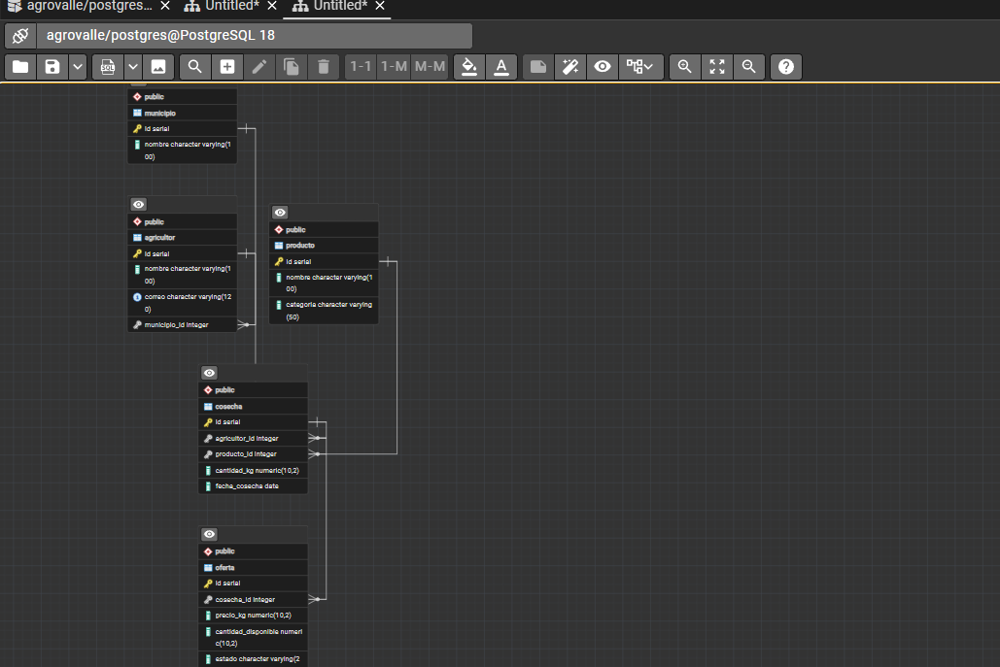
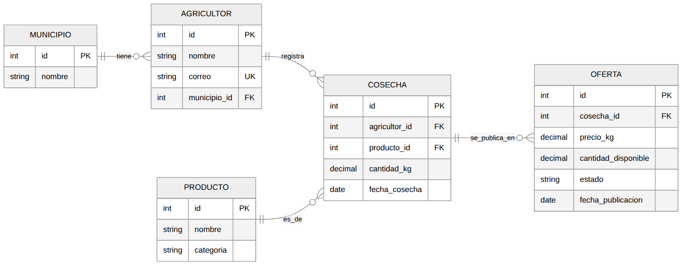
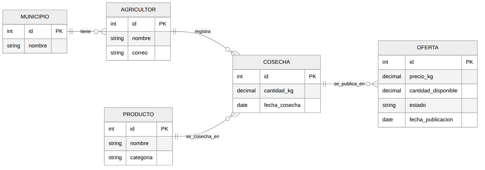
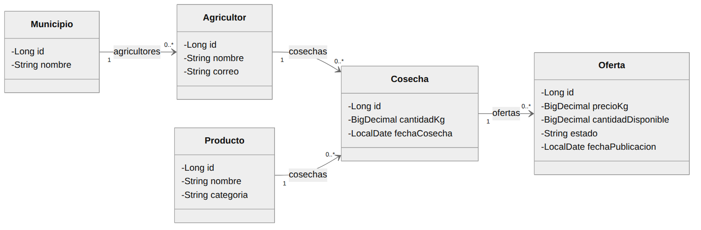

# Anexo de diagramas

Sprint de diseño: modelo de datos, arquitectura y prototipado

Ingeniería de Software II \| Proyecto AgroValle \| Estudiante(s): Grupo 5

## Índice de diagramas

| **N.º** | **Diagrama**                | **Qué representa**                                             | **Origen**         |
|---------|-----------------------------|----------------------------------------------------------------|--------------------|
| 1       | Captura de pgAdmin (ERD)    | Las 5 tablas creadas en PostgreSQL con sus llaves y relaciones | Captura del equipo |
| 2       | Modelo físico (referencia)  | Las mismas tablas con tipos de dato, PK, FK y UK               | Generado           |
| 3       | MER conceptual              | Entidades, atributos y relaciones, sin llaves foráneas         | Generado           |
| 4       | Modelo de dominio UML       | Las entidades como clases Java con sus asociaciones            | Generado           |
| 5       | Secuencia: Registrar oferta | Recorrido de una petición por las capas del sistema            | Generado           |
| 6       | Componentes                 | Paquetes del sistema y sus dependencias                        | Generado           |
| 7       | Despliegue                  | Nodos físicos donde corre el sistema                           | Generado           |
| 8       | Flujo de pantallas          | Navegación entre las 6 pantallas                               | Generado           |
| 9 a 14  | Mockups (6 pantallas)       | Wireframes de baja fidelidad de cada pantalla                  | Generado           |

## Punto 1. Modelo de datos

### Diagrama 1. Captura de pgAdmin (ERD de la base de datos)

**Qué es:** diagrama entidad-relación generado por pgAdmin 4 a partir de las tablas creadas en la base de datos agrovalle (PostgreSQL 18).

**Para qué sirve:** demostrar que el script SQL se ejecutó correctamente y que las tablas municipio, agricultor, producto, cosecha y oferta quedaron relacionadas mediante llaves foráneas.

*Figura 1. Captura de pgAdmin (ERD de la base de datos)*

### Diagrama 2. Modelo físico (diagrama de referencia)

**Qué es:** representación del mismo modelo con los tipos de dato y las restricciones: PK (llave primaria), FK (llave foránea) y UK (valor único).

**Para qué sirve:** documentar la estructura exacta de cada tabla, y ver de un vistazo cómo se enlazan las llaves foráneas.

*Figura 2. Modelo físico (diagrama de referencia)*

### Diagrama 3. MER conceptual

**Qué es:** modelo entidad-relación en su nivel conceptual: muestra las entidades, sus atributos y las relaciones uno a muchos, sin llaves foráneas.

**Para qué sirve:** representar el negocio antes de pensar en tablas; es el diagrama que se hace primero, antes de normalizar.

*Figura 3. MER conceptual*

### Diagrama 4. Modelo de dominio UML

**Qué es:** diagrama de clases con las cinco entidades, sus atributos con tipos Java y las asociaciones con su multiplicidad (1 a 0..\*).

**Para qué sirve:** mostrar cómo se ve el modelo de datos desde la programación orientada a objetos; es la base de las entidades JPA.

*Figura 4. Modelo de dominio UML*

## Punto 2. Arquitectura de software

### Diagrama 5. Secuencia: Registrar oferta

**Qué es:** diagrama de secuencia del caso de uso "Registrar oferta", desde el agricultor hasta la base de datos, pasando por vista, controlador, servicio y repositorios.

**Para qué sirve:** explicar el orden de las llamadas entre las capas y qué mensaje intercambia cada una.

*Figura 5. Secuencia: Registrar oferta*

### Diagrama 6. Componentes

**Qué es:** diagrama de los paquetes de la arquitectura MVC en capas (controller, service, repository, dto, mapper y model) y de quién depende cada uno.

**Para qué sirve:** mostrar la estructura estática del sistema y comprobar que cada capa solo se comunica con la contigua.

*Figura 6. Componentes*

### Diagrama 7. Despliegue

**Qué es:** diagrama de los tres nodos físicos: navegador del usuario, servidor de aplicaciones (Spring Boot) y servidor de base de datos (PostgreSQL), con sus protocolos y puertos.

**Para qué sirve:** indicar dónde se ejecuta cada pieza del sistema y cómo se comunican entre sí.

*Figura 7. Despliegue*

## Punto 3. Prototipado

### Diagrama 8. Flujo de pantallas

**Qué es:** diagrama de navegación entre las seis pantallas del sistema, con la acción que lleva de una a otra.

**Para qué sirve:** validar con el Product Owner el recorrido completo del usuario.

*Figura 8. Flujo de pantallas*

### Diagrama 9. Mockup: Login

**Qué es:** wireframe de la pantalla de inicio de sesión.

**Para qué sirve:** validar los campos de acceso y el enlace al registro.

*Figura 9. Mockup: Login*

### Diagrama 10. Mockup: Registro de agricultor

**Qué es:** wireframe del formulario de registro de un nuevo agricultor.

**Para qué sirve:** validar los datos que se piden al crear la cuenta.

*Figura 10. Mockup: Registro de agricultor*

### Diagrama 11. Mockup: Panel principal

**Qué es:** wireframe de la pantalla de inicio del agricultor, con las tres opciones principales y sus últimas cosechas.

**Para qué sirve:** validar el menú de acceso a las funciones del sistema.

*Figura 11. Mockup: Panel principal*

### Diagrama 12. Mockup: Registrar cosecha

**Qué es:** wireframe del formulario para registrar una cosecha.

**Para qué sirve:** validar los campos de producto, cantidad y fecha.

*Figura 12. Mockup: Registrar cosecha*

### Diagrama 13. Mockup: Publicar oferta

**Qué es:** wireframe del formulario para publicar una cosecha como oferta de venta.

**Para qué sirve:** validar los campos de precio y cantidad disponible.

*Figura 13. Mockup: Publicar oferta*

### Diagrama 14. Mockup: Lista de ofertas

**Qué es:** wireframe de la pantalla que lista las ofertas con filtros y paginación.

**Para qué sirve:** validar los filtros y las columnas de la tabla.

*Figura 14. Mockup: Lista de ofertas*
