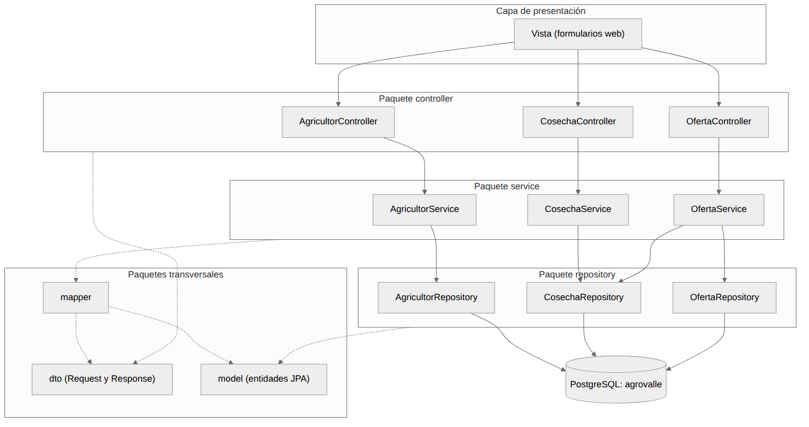
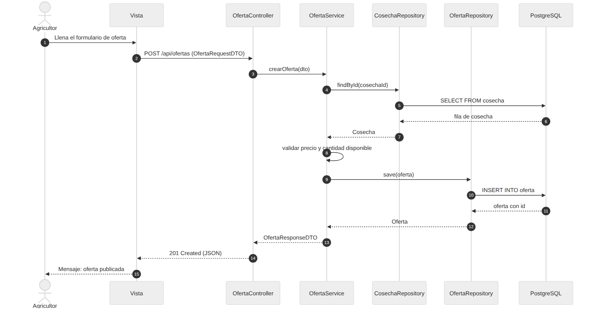
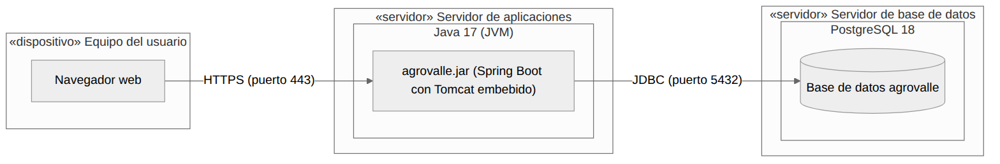

# Documento de arquitectura de software

Arquitectura MVC en capas con Spring Boot

Ingeniería de Software II \| Proyecto AgroValle \| Grupo 5

## 1. Objetivo

Este documento describe la arquitectura de software del proyecto: el estilo arquitectónico elegido (MVC en capas), la organización de paquetes, los diagramas de componentes, secuencia y despliegue, y los patrones de diseño aplicados. La tecnología base es Java 17, Spring Boot, Spring Data JPA y PostgreSQL.

## 2. Estilo arquitectónico: MVC en capas

El sistema se organiza en capas donde cada una tiene una única responsabilidad y solo se comunica con la capa contigua. Esto reduce el acoplamiento, facilita las pruebas y permite modificar una capa sin afectar a las demás.

| **Capa**             | **Paquete** | **Responsabilidad**                                                                                | **Anotación en Spring**       |
|----------------------|-------------|----------------------------------------------------------------------------------------------------|-------------------------------|
| Presentación (Vista) | —           | Formularios y pantallas con las que interactúa el usuario; envía y recibe datos del controlador.   | —                             |
| Controlador          | controller  | Recibe las peticiones HTTP, valida la entrada y delega al servicio. No contiene lógica de negocio. | @RestController               |
| Servicio             | service     | Contiene la lógica de negocio y las reglas del sistema. Coordina repositorios y mappers.           | @Service                      |
| Acceso a datos       | repository  | Consulta y persiste las entidades en la base de datos.                                             | @Repository (Spring Data JPA) |
| Modelo               | model       | Entidades JPA que representan las tablas.                                                          | @Entity                       |
| Transferencia        | dto, mapper | Objetos que viajan entre capas y conversión entre DTO y entidad.                                   | @Component (mapper)           |

### Estructura de paquetes

```text
com.agrovalle
├── controller   (AgricultorController, CosechaController, OfertaController)
├── service      (AgricultorService, CosechaService, OfertaService)
├── repository   (AgricultorRepository, CosechaRepository, OfertaRepository)
├── model        (entidades JPA: Municipio, Agricultor, Producto, Cosecha, Oferta)
├── dto          (OfertaRequestDTO, OfertaResponseDTO, ...)
├── mapper       (OfertaMapper, ...)
└── AgrovalleApplication.java
```

## 3. Diagrama de componentes

El diagrama muestra los paquetes del sistema y sus dependencias. Las flechas continuas indican llamadas entre capas (Vista → Controller → Service → Repository → Base de datos); las punteadas indican el uso de los paquetes de apoyo (dto, mapper y model).



*Figura 1. Diagrama de componentes de la arquitectura MVC en capas*

Reglas que se respetan:

- El controlador nunca accede directamente a la base de datos ni a los repositorios.

- El repositorio no contiene reglas de negocio; solo consulta y guarda datos.

- Las entidades JPA no se exponen al cliente: la comunicación externa se hace con DTO.

## 4. Diagrama de secuencia: registrar oferta

El caso de uso "Registrar oferta" permite que un agricultor publique una cosecha para su venta. El diagrama muestra cómo la petición atraviesa las capas hasta guardarse en PostgreSQL.



*Figura 2. Diagrama de secuencia del caso de uso Registrar oferta*

| **Paso** | **Descripción**                                                                                               |
|----------|---------------------------------------------------------------------------------------------------------------|
| 1-2      | El agricultor llena el formulario y la vista envía POST /api/ofertas con un OfertaRequestDTO.                 |
| 3        | OfertaController recibe la petición y delega en OfertaService.crearOferta(dto).                               |
| 4-7      | El servicio consulta la cosecha en CosechaRepository (SELECT en la tabla cosecha) para verificar que existe.  |
| 8        | El servicio valida las reglas de negocio: precio y cantidad disponible válidos.                               |
| 9-12     | OfertaRepository guarda la oferta (INSERT en la tabla oferta) y devuelve la entidad con su id.                |
| 13-15    | El servicio devuelve un OfertaResponseDTO; el controlador responde 201 Created y la vista informa al usuario. |

## 5. Diagrama de despliegue

El diagrama muestra la distribución física del sistema en tres nodos. En desarrollo, los nodos del servidor de aplicaciones y de la base de datos pueden ejecutarse en la misma máquina (localhost).



*Figura 3. Diagrama de despliegue del sistema*

| **Nodo**                  | **Software / artefacto**                                       | **Comunicación**                                     |
|---------------------------|----------------------------------------------------------------|------------------------------------------------------|
| Equipo del usuario        | Navegador web                                                  | HTTPS (puerto 443) hacia el servidor de aplicaciones |
| Servidor de aplicaciones  | Java 17 (JVM), agrovalle.jar con Spring Boot y Tomcat embebido | JDBC (puerto 5432) hacia la base de datos            |
| Servidor de base de datos | PostgreSQL 18, base de datos agrovalle                         | Recibe conexiones JDBC del servidor de aplicaciones  |

## 6. Patrones de diseño aplicados

### 6.1 Repository

**Problema:** el código de negocio no debería depender de cómo se consultan o guardan los datos.

**Solución:** una interfaz que encapsula el acceso a datos. Con Spring Data JPA solo se declara la interfaz y el framework genera la implementación.

**Dónde se aplica:** paquete repository (AgricultorRepository, CosechaRepository, OfertaRepository).

```java
public interface OfertaRepository extends JpaRepository<Oferta, Long> {

    List<Oferta> findByEstado(String estado);

}
```

### 6.2 DTO (Data Transfer Object)

**Problema:** exponer las entidades JPA directamente al cliente revela la estructura interna de la base de datos y acopla la API a ella.

**Solución:** objetos simples, solo con los datos necesarios, que viajan entre el cliente y el controlador (RequestDTO para entrada, ResponseDTO para salida).

**Dónde se aplica:** paquete dto (por ejemplo, OfertaRequestDTO y OfertaResponseDTO).

```java
public record OfertaRequestDTO(Long cosechaId,
                               BigDecimal precioKg,
                               BigDecimal cantidadDisponible) {}
```

### 6.3 Data Mapper

**Problema:** convertir entre entidades y DTO dentro del servicio ensucia la lógica de negocio con código repetitivo.

**Solución:** una clase dedicada a la conversión entre DTO y entidad, escrita a mano o generada con MapStruct.

**Dónde se aplica:** paquete mapper (OfertaMapper), usado por los servicios.

```java
@Component
public class OfertaMapper {

    public Oferta toEntity(OfertaRequestDTO dto, Cosecha cosecha) {
        Oferta o = new Oferta();
        o.setCosecha(cosecha);
        o.setPrecioKg(dto.precioKg());
        o.setCantidadDisponible(dto.cantidadDisponible());
        return o;
    }

}
```

### 6.4 Singleton e inversión de control (IoC)

**Problema:** crear los objetos con new genera acoplamiento fuerte y dificulta las pruebas.

**Solución:** el contenedor de Spring crea una única instancia (singleton) de cada componente (@Service, @Repository, @RestController, @Component) y la inyecta por constructor donde se necesita. La clase declara sus dependencias y no las crea.

**Dónde se aplica:** en todas las capas; el ejemplo muestra el servicio y el controlador.

```java
@Service
public class OfertaService {

    private final OfertaRepository ofertaRepository;
    private final CosechaRepository cosechaRepository;
    private final OfertaMapper mapper;

    public OfertaService(OfertaRepository ofertaRepository,
                         CosechaRepository cosechaRepository,
                         OfertaMapper mapper) {
        this.ofertaRepository = ofertaRepository;
        this.cosechaRepository = cosechaRepository;
        this.mapper = mapper;
    }

}

@RestController
@RequestMapping("/api/ofertas")
public class OfertaController {

    private final OfertaService ofertaService;

    public OfertaController(OfertaService ofertaService) {
        this.ofertaService = ofertaService;
    }

    @PostMapping
    public ResponseEntity<OfertaResponseDTO> crear(
            @RequestBody OfertaRequestDTO dto) {
        return ResponseEntity.status(HttpStatus.CREATED)
                .body(ofertaService.crearOferta(dto));
    }

}
```

## 7. Conclusiones

- La arquitectura MVC en capas separa responsabilidades y deja cada capa con una única razón para cambiar.

- Los diagramas de componentes, secuencia y despliegue documentan la estructura estática, el comportamiento y la distribución física del sistema.

- Los patrones Repository, DTO, Data Mapper e IoC reducen el acoplamiento y hacen el código más fácil de probar y mantener.

- El modelo de datos definido en el punto anterior se integra con esta arquitectura a través de las entidades JPA del paquete model.

## 8. Requisitos de Software (IEEE 29148)

### Requisitos Funcionales
| ID | Requisito | Descripción | Criterio de Aceptación |
|---|---|---|---|
| RF-01 | Registrar Oferta | El agricultor puede publicar cosechas para venta. | Recibe DTO válido y retorna HTTP 201 Created. |

### Requisitos No Funcionales
- **RNF-01 (Seguridad):** Autenticación basada en JWT para endpoints protegidos.
- **RNF-02 (Rendimiento):** Consultas JPA optimizadas con respuesta en < 200 ms.

---

## 9. Estrategia de Pruebas: TDD y BDD

### BDD (Gherkin - Cucumber / Scenario)
**Escenario:** Publicación exitosa de una oferta de cultivo
- **Dado que** el agricultor autenticado tiene una cosecha disponible
- **Cuando** envía los datos de la oferta con un precio y cantidad válidos
- **Entonces** el sistema guarda la oferta en PostgreSQL y responde HTTP 201 Created.

### TDD (Ciclo JUnit 5 + Mockito)
1. **Red:** Se crea la prueba unitaria en `OfertaServiceTest` que falla si el precio es negativo.
2. **Green:** Se implementa la validación en `OfertaService`.
3. **Refactor:** Se limpia el código utilizando DTOs y Mappers.
