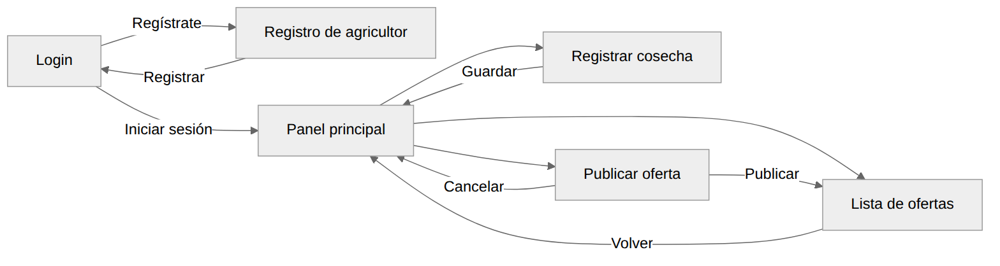
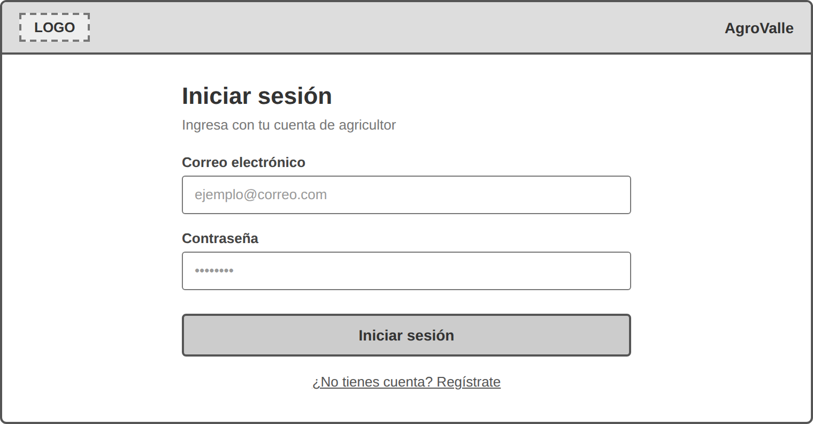
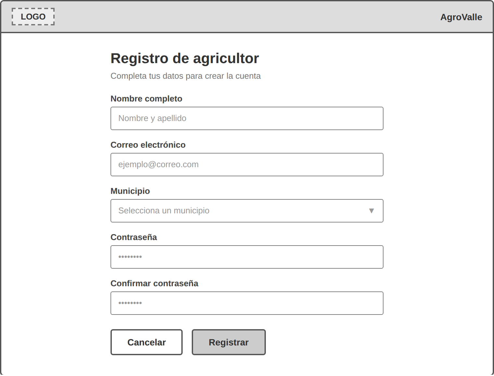
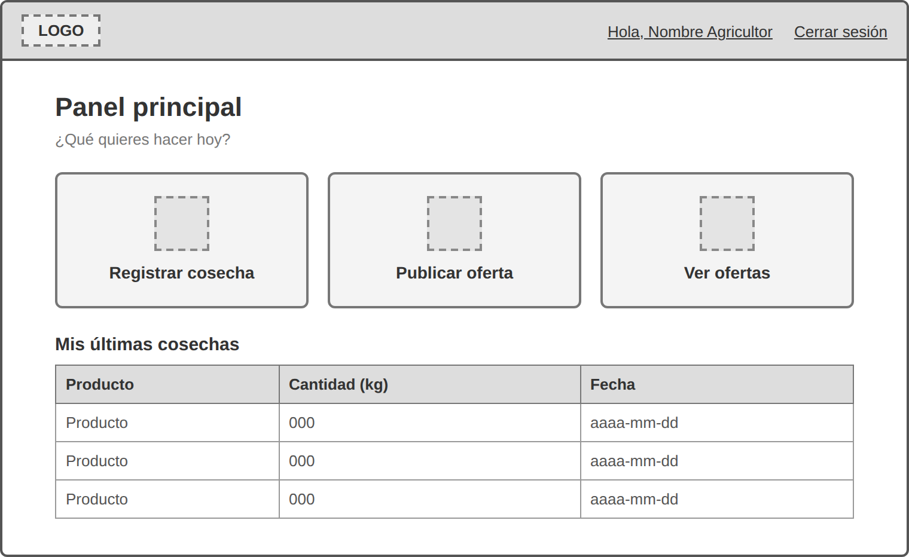
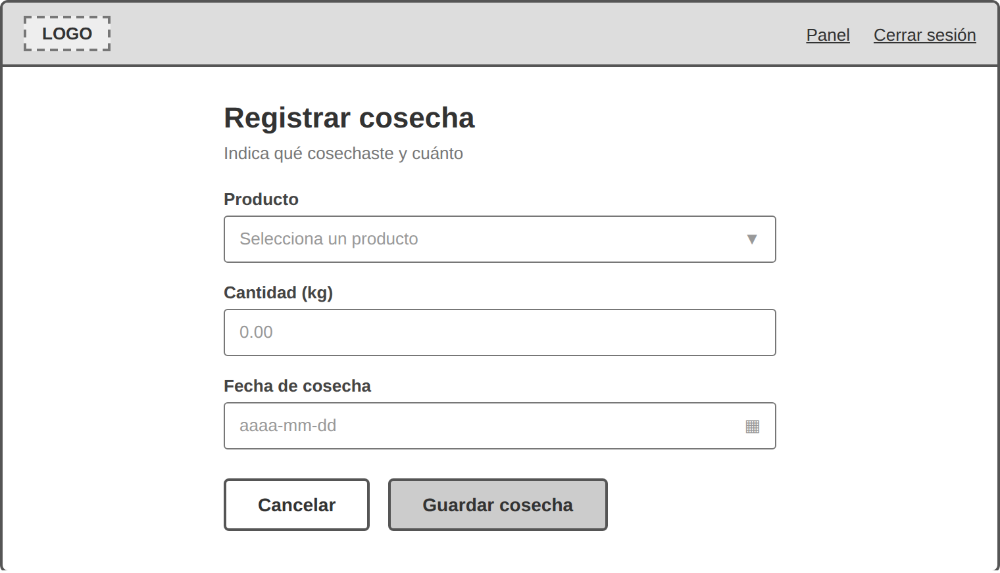
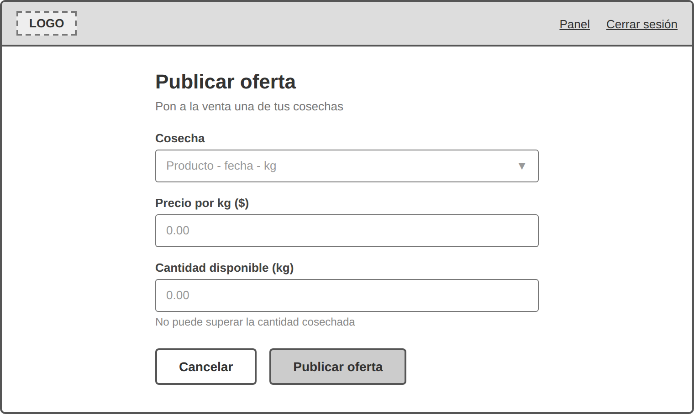
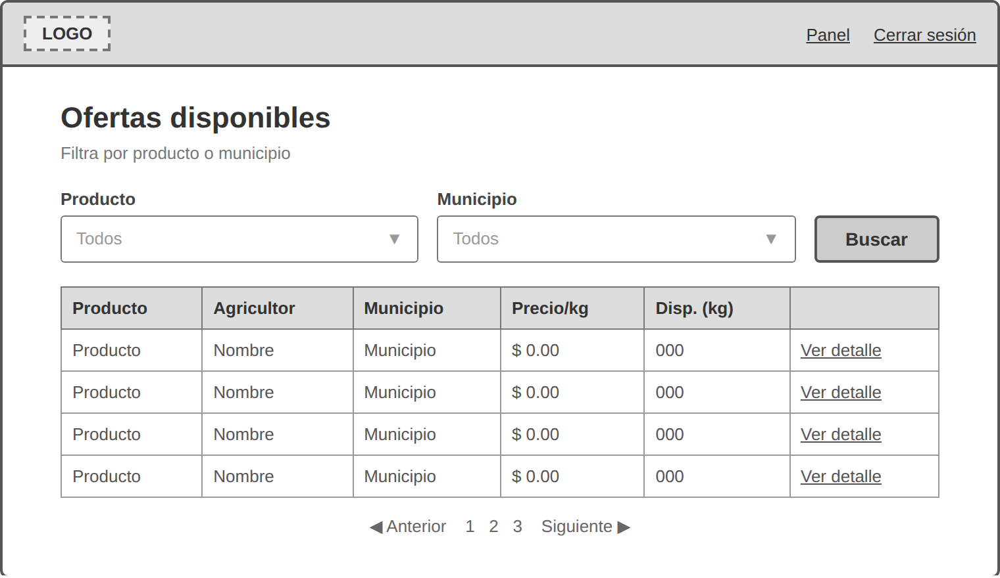

# Documento de prototipado

Mockups de baja fidelidad y flujo de pantallas

Ingeniería de Software II \| Proyecto AgroValle \| Estudiante(s): Grupo 5

## 1. Objetivo y alcance

Este documento presenta los prototipos de baja fidelidad (wireframes) de las pantallas principales de AgroValle, junto con el flujo de navegación entre ellas. El propósito es validar la estructura, los campos y el recorrido del usuario con el Product Owner antes de construir las interfaces definitivas, evitando retrabajo en el desarrollo.

Los mockups se dibujan en escala de grises, sin colores, tipografías finales ni imágenes, para centrar la discusión en el contenido y el comportamiento y no en la estética. Los campos de cada formulario corresponden a las tablas definidas en el modelo de datos (municipio, agricultor, producto, cosecha y oferta) y a los DTO de la arquitectura.

## 2. Criterios de diseño

- **Consistencia:** todas las pantallas comparten la barra superior (logo y opciones de sesión) y la misma disposición de formularios.

- **Etiquetas sobre el campo:** cada campo muestra su nombre arriba y un texto de ejemplo (placeholder) dentro.

- **Botones:** la acción principal (Registrar, Guardar, Publicar) se muestra rellena en gris; la acción secundaria (Cancelar) con borde y fondo blanco.

- **Listas desplegables:** se identifican con una flecha (▼) y se alimentan de las tablas de la base de datos.

- **Mensajes:** los errores de validación se muestran debajo del campo afectado; las confirmaciones, en la parte superior del formulario.

## 3. Flujo de pantallas

El diagrama muestra cómo navega el usuario entre las seis pantallas del sistema. El Panel principal es el centro de navegación: desde allí se accede a registrar cosechas, publicar ofertas y consultar las ofertas disponibles.

*Figura 1. Flujo de navegación entre pantallas*

| **N.º** | **Pantalla**           | **Navegación**                                                                                 |
|---------|------------------------|------------------------------------------------------------------------------------------------|
| 1       | Login                  | Inicia sesión y va al Panel principal, o abre el Registro de agricultor.                       |
| 2       | Registro de agricultor | Al registrar vuelve al Login con un mensaje de confirmación; Cancelar también vuelve al Login. |
| 3       | Panel principal        | Accede a Registrar cosecha, Publicar oferta y Ver ofertas.                                     |
| 4       | Registrar cosecha      | Al guardar vuelve al Panel principal; Cancelar también.                                        |
| 5       | Publicar oferta        | Al publicar va a la Lista de ofertas; Cancelar vuelve al Panel.                                |
| 6       | Lista de ofertas       | Permite filtrar y ver el detalle; Volver regresa al Panel principal.                           |

## 4. Mockups

### 1. Login

**Propósito:** permitir que el agricultor acceda a su cuenta.

*Figura 2. Mockup de baja fidelidad: Login*

| **Elemento**                  | **Tipo**            | **Obligatorio** | **Comportamiento / validación**                                                                      |
|-------------------------------|---------------------|-----------------|------------------------------------------------------------------------------------------------------|
| Correo electrónico            | Campo de texto      | Sí              | Formato de correo válido.                                                                            |
| Contraseña                    | Campo de contraseña | Sí              | Se muestra enmascarada. Mínimo 8 caracteres.                                                         |
| Iniciar sesión                | Botón principal     | —               | Valida las credenciales y lleva al Panel principal; si son incorrectas, muestra un mensaje de error. |
| ¿No tienes cuenta? Regístrate | Enlace              | —               | Abre el Registro de agricultor.                                                                      |

### 2. Registro de agricultor

**Propósito:** crear la cuenta de un nuevo agricultor (tabla agricultor).

*Figura 3. Mockup de baja fidelidad: Registro de agricultor*

| **Elemento**         | **Tipo**            | **Obligatorio** | **Comportamiento / validación**                                     |
|----------------------|---------------------|-----------------|---------------------------------------------------------------------|
| Nombre completo      | Campo de texto      | Sí              | No puede estar vacío. Máximo 100 caracteres.                        |
| Correo electrónico   | Campo de texto      | Sí              | Formato válido y único en el sistema (restricción UNIQUE).          |
| Municipio            | Lista desplegable   | Sí              | Se carga desde la tabla municipio.                                  |
| Contraseña           | Campo de contraseña | Sí              | Mínimo 8 caracteres.                                                |
| Confirmar contraseña | Campo de contraseña | Sí              | Debe coincidir con la contraseña.                                   |
| Cancelar             | Botón secundario    | —               | Descarta los datos y vuelve al Login.                               |
| Registrar            | Botón principal     | —               | Guarda al agricultor y vuelve al Login con mensaje de confirmación. |

### 3. Panel principal

**Propósito:** centralizar el acceso a las funciones del agricultor.

*Figura 4. Mockup de baja fidelidad: Panel principal*

| **Elemento**              | **Tipo**              | **Obligatorio** | **Comportamiento / validación**                                                  |
|---------------------------|-----------------------|-----------------|----------------------------------------------------------------------------------|
| Saludo y Cerrar sesión    | Texto y enlace        | —               | Muestra el nombre del agricultor autenticado; Cerrar sesión vuelve al Login.     |
| Tarjeta Registrar cosecha | Tarjeta (acceso)      | —               | Abre el formulario Registrar cosecha.                                            |
| Tarjeta Publicar oferta   | Tarjeta (acceso)      | —               | Abre el formulario Publicar oferta.                                              |
| Tarjeta Ver ofertas       | Tarjeta (acceso)      | —               | Abre la Lista de ofertas.                                                        |
| Mis últimas cosechas      | Tabla de solo lectura | —               | Muestra producto, cantidad y fecha de las cosechas más recientes del agricultor. |

### 4. Registrar cosecha

**Propósito:** registrar qué producto cosechó el agricultor y en qué cantidad (tabla cosecha).

*Figura 5. Mockup de baja fidelidad: Registrar cosecha*

| **Elemento**     | **Tipo**          | **Obligatorio** | **Comportamiento / validación**                                                          |
|------------------|-------------------|-----------------|------------------------------------------------------------------------------------------|
| Producto         | Lista desplegable | Sí              | Se carga desde la tabla producto.                                                        |
| Cantidad (kg)    | Campo numérico    | Sí              | Mayor que 0, hasta 2 decimales.                                                          |
| Fecha de cosecha | Selector de fecha | Sí              | No puede ser una fecha futura.                                                           |
| Cancelar         | Botón secundario  | —               | Descarta los datos y vuelve al Panel principal.                                          |
| Guardar cosecha  | Botón principal   | —               | Guarda la cosecha asociada al agricultor autenticado y vuelve al Panel con confirmación. |

### 5. Publicar oferta

**Propósito:** poner a la venta una cosecha ya registrada (tabla oferta).

*Figura 6. Mockup de baja fidelidad: Publicar oferta*

| **Elemento**             | **Tipo**          | **Obligatorio** | **Comportamiento / validación**                                                                    |
|--------------------------|-------------------|-----------------|----------------------------------------------------------------------------------------------------|
| Cosecha                  | Lista desplegable | Sí              | Muestra solo las cosechas del agricultor autenticado, con producto, fecha y cantidad.              |
| Precio por kg (\$)       | Campo numérico    | Sí              | Mayor que 0, hasta 2 decimales.                                                                    |
| Cantidad disponible (kg) | Campo numérico    | Sí              | Mayor que 0 y no puede superar la cantidad cosechada.                                              |
| Cancelar                 | Botón secundario  | —               | Descarta los datos y vuelve al Panel principal.                                                    |
| Publicar oferta          | Botón principal   | —               | Crea la oferta con estado ACTIVA y fecha de publicación actual; luego muestra la Lista de ofertas. |

### 6. Lista de ofertas

**Propósito:** consultar las ofertas publicadas y filtrarlas.

*Figura 7. Mockup de baja fidelidad: Lista de ofertas*

| **Elemento**     | **Tipo**              | **Obligatorio** | **Comportamiento / validación**                                                                                     |
|------------------|-----------------------|-----------------|---------------------------------------------------------------------------------------------------------------------|
| Filtro Producto  | Lista desplegable     | No              | Opción "Todos" por defecto; se carga desde la tabla producto.                                                       |
| Filtro Municipio | Lista desplegable     | No              | Opción "Todos" por defecto; se carga desde la tabla municipio.                                                      |
| Buscar           | Botón principal       | —               | Aplica los filtros y actualiza la tabla.                                                                            |
| Tabla de ofertas | Tabla de solo lectura | —               | Columnas: producto, agricultor, municipio, precio/kg y cantidad disponible. Solo muestra ofertas con estado ACTIVA. |
| Ver detalle      | Enlace                | —               | Abre el detalle de la oferta seleccionada.                                                                          |
| Paginación       | Controles             | —               | Navega entre páginas de resultados.                                                                                 |

## 5. Validación con el Product Owner

La siguiente tabla se usa en la sesión de revisión para registrar las observaciones del Product Owner y el estado de aprobación de cada pantalla.

| **N.º** | **Pantalla**           | **Observaciones del Product Owner** | **Estado**               |
|---------|------------------------|-------------------------------------|--------------------------|
| 1       | Login                  |                                     | ☐ Aprobada ☐ Con cambios |
| 2       | Registro de agricultor |                                     | ☐ Aprobada ☐ Con cambios |
| 3       | Panel principal        |                                     | ☐ Aprobada ☐ Con cambios |
| 4       | Registrar cosecha      |                                     | ☐ Aprobada ☐ Con cambios |
| 5       | Publicar oferta        |                                     | ☐ Aprobada ☐ Con cambios |
| 6       | Lista de ofertas       |                                     | ☐ Aprobada ☐ Con cambios |

**Fecha de la revisión:** \_\_\_\_\_\_\_\_\_\_\_\_\_\_\_\_\_\_\_\_

**Product Owner:** \_\_\_\_\_\_\_\_\_\_\_\_\_\_\_\_\_\_\_\_

## 6. Conclusiones

- Los wireframes definen la estructura, los campos y el recorrido de las seis pantallas principales antes de invertir tiempo en diseño visual y código.

- Cada formulario es coherente con el modelo de datos y con los DTO de la arquitectura, lo que facilita el desarrollo posterior.

- El flujo de navegación parte del Panel principal, lo que mantiene el sistema simple para usuarios con poca experiencia digital.

- Con la validación del Product Owner se pueden ajustar campos, textos y navegación sin costo de desarrollo.
